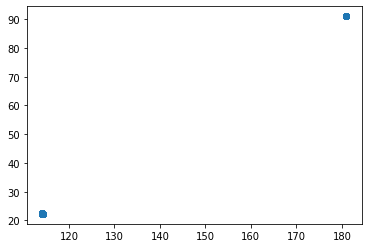
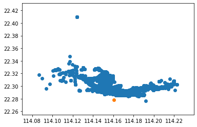

```python
import ais
import collections
ship_pos = collections.namedtuple("ship_pos","lon lat")

ships=[]
with ais.io.open('/Users/tseed/Dev/sdr/rtl-ais/20190715ais.dat') as aisfile:
    for msg in aisfile:
        if 'decoded' in msg and 'x' in msg['decoded']:
            s=ship_pos(msg['decoded']['x'],msg['decoded']['y'])
            ships.append(s)
```

    ERROR:libais:Unable to decode message: Ais24: AIS_ERR_BAD_BIT_COUNT
      1736 !AIVDM,1,1,,A,H6:fSn1UDF0QDV1`PuF0QDwSS>0,0*42
    ERROR:libais:Unable to decode message: Ais24: AIS_ERR_BAD_BIT_COUNT
      3560 !AIVDM,1,1,,A,H6:V4fh`Tr0htpN3G;R22222220,0*45
    ERROR:libais:Unable to decode message: Ais24: AIS_ERR_BAD_BIT_COUNT
      6069 !AIVDM,1,1,,B,H69G=r0@V1LDV3G3J2222222220,0*2C
    ERROR:libais:Unable to decode message: Ais24: AIS_ERR_BAD_BIT_COUNT
      7960 !AIVDM,1,1,,A,H69G=r0@V1LDV3G3J2222222220,0*2F
    ERROR:libais:Unable to decode message: Ais24: AIS_ERR_BAD_BIT_COUNT
      8517 !AIVDM,1,1,,A,H6:ff5A`PtpM4TiDs;?P0000000,0*35
    ERROR:libais:Unable to decode message: Ais24: AIS_ERR_BAD_BIT_COUNT
      10951 !AIVDM,1,1,,B,H=JCpSR22222222222222222220,0*2A
    ERROR:libais:Unable to decode message: Ais24: AIS_ERR_BAD_BIT_COUNT
      11989 !AIVDM,1,1,,A,H77nR:@IDhj1L4V0pvs:2222220,0*77
    ERROR:libais:Unable to decode message: Ais24: AIS_ERR_BAD_BIT_COUNT
      12046 !AIVDM,1,1,,B,H=JCpSR22222222222222222220,0*2A
    ERROR:libais:Unable to decode message: Ais24: AIS_ERR_BAD_BIT_COUNT
      12307 !AIVDM,1,1,,A,H77nR:@IDhj1L4V0pvs:2222220,0*77
    ERROR:libais:Unable to decode message: Ais24: AIS_ERR_BAD_BIT_COUNT
      12530 !AIVDM,1,1,,A,H77nR:@IDhj1L4V0pvs:2222220,0*77
    ERROR:libais:Unable to decode message: Ais24: AIS_ERR_BAD_BIT_COUNT
      12623 !AIVDM,1,1,,A,H77nT<@iDDr1T4r37KR22222220,0*0F
    ERROR:libais:Unable to decode message: Ais24: AIS_ERR_BAD_BIT_COUNT
      13006 !AIVDM,1,1,,A,H77nR:@IDhj1L4V0pvs:2222220,0*77
    ERROR:libais:Unable to decode message: Ais24: AIS_ERR_BAD_BIT_COUNT
      13546 !AIVDM,1,1,,A,H=JCpSR22222222222222222220,0*29
    ERROR:libais:Unable to decode message: Ais24: AIS_ERR_BAD_BIT_COUNT
      14140 !AIVDM,1,1,,A,H77nT<@iDDr1T4r37KR22222220,0*0F
    ERROR:libais:Unable to decode message: Ais8: AIS_UNINITIALIZED
      14270 !AIVDM,1,1,,B,877nSWiKdP2mQ5iqG0W=auWOsO4uA>4;eRD7>4NNVP,0*16
    ERROR:libais:Unable to decode message: Ais8: AIS_UNINITIALIZED
      14323 !AIVDM,1,1,,A,877nSWiKddWu68qMJpBMjSb=9Vc?n5UcA8p;4W0i2P,0*21
    ERROR:libais:Unable to decode message: Ais24: AIS_ERR_BAD_BIT_COUNT
      17928 !AIVDM,1,1,,B,H=JCpSR22222222222222222220,0*2A
    ERROR:libais:Unable to decode message: Ais24: AIS_ERR_BAD_BIT_COUNT
      18543 !AIVDM,1,1,,A,H=JCpSR22222222222222222220,0*29
    ERROR:libais:Unable to decode message: Ais24: AIS_ERR_BAD_BIT_COUNT
      19103 !AIVDM,1,1,,B,H=JCpSR22222222222222222220,0*2A
    ERROR:libais:Unable to decode message: Ais24: AIS_ERR_BAD_BIT_COUNT
      19549 !AIVDM,1,1,,A,H=JCpSR22222222222222222220,0*29
    ERROR:libais:Unable to decode message: Ais24: AIS_ERR_BAD_BIT_COUNT
      19868 !AIVDM,1,1,,A,H2vgI6S;3333GW7B22222222220,0*0F
    ERROR:libais:Unable to decode message: Ais24: AIS_ERR_BAD_BIT_COUNT
      20516 !AIVDM,1,1,,A,H2vgI6S;3333GW7B22222222220,0*0F
    ERROR:libais:Unable to decode message: Ais24: AIS_ERR_BAD_BIT_COUNT
      20962 !AIVDM,1,1,,A,H2vgI6S;3333GW7B22222222220,0*0F
    ERROR:libais:Unable to decode message: Ais24: AIS_ERR_BAD_BIT_COUNT
      21183 !AIVDM,1,1,,B,H7f6FC@mJ1=A84ppTd000000000,0*29
    ERROR:libais:Unable to decode message: Ais24: AIS_ERR_BAD_BIT_COUNT
      21210 !AIVDM,1,1,,A,H=JCpSR22222222222222222220,0*29
    ERROR:libais:Unable to decode message: Ais24: AIS_ERR_BAD_BIT_COUNT
      21647 !AIVDM,1,1,,B,H=JCpSR22222222222222222220,0*2A
    ERROR:libais:Unable to decode message: Ais24: AIS_ERR_BAD_BIT_COUNT
      22580 !AIVDM,1,1,,B,H=JCpSR22222222222222222220,0*2A
    ERROR:libais:Unable to decode message: Ais24: AIS_ERR_BAD_BIT_COUNT
      23094 !AIVDM,1,1,,A,H2vgUrR22222222222222222220,0*3A
    ERROR:libais:Unable to decode message: Ais24: AIS_ERR_BAD_BIT_COUNT
      23661 !AIVDM,1,1,,B,H68rO00QCSP0000000000000000,0*4F
    ERROR:libais:Unable to decode message: Ais24: AIS_ERR_BAD_BIT_COUNT
      26545 !AIVDM,1,1,,A,H69??B3G3SN2222222222222220,0*7B
    ERROR:libais:Unable to decode message: Ais24: AIS_ERR_BAD_BIT_COUNT
      26654 !AIVDM,1,1,,A,H77nRRP<PEDpN0dDF0pvs;T0000,0*7F
    ERROR:libais:Unable to decode message: Ais24: AIS_ERR_BAD_BIT_COUNT
      27427 !AIVDM,1,1,,A,H77nR:@IDhj1L4V0pvs:2222220,0*77


```python
ships[:10]
```


    [ship_pos(lon=114.167945, lat=22.293645),
     ship_pos(lon=114.15414, lat=22.312008333333335),
     ship_pos(lon=114.15375, lat=22.294233333333334),
     ship_pos(lon=114.16397833333333, lat=22.292006666666666),
     ship_pos(lon=114.124445, lat=22.409443333333332),
     ship_pos(lon=114.1663, lat=22.300298333333334),
     ship_pos(lon=114.166775, lat=22.294233333333334),
     ship_pos(lon=114.14953, lat=22.31884833333333),
     ship_pos(lon=114.147575, lat=22.306623333333334),
     ship_pos(lon=114.15414166666666, lat=22.31201)]


```python
import matplotlib.pyplot as plt
```


```python
lon=[]
lat=[]
for vessel in ships:
    lon.append(vessel.lon)
    lat.append(vessel.lat)
plt.scatter(lon, lat)
plt.show()

```





```python
# Our graph is being distorted by data at 180,90 (South Pole !!!)
# Lets loose that data 
lon=[]
lat=[]
myloc = [114.160950,22.278508] # Where my RTL device is sitting
for vessel in ships:
    if vessel.lat<80:
        lon.append(vessel.lon)
        lat.append(vessel.lat)
fig, ax = plt.subplots()
ship_scatter = ax.scatter(lon, lat)
my_location = ax.scatter(myloc[0], myloc[1])
plt.show()
# This shows very clearly that my antenna is only getting data from 1 side.... There is no South/East or West Data ... Mountains/sky-scrapers are the reason. 

```





```python

```
